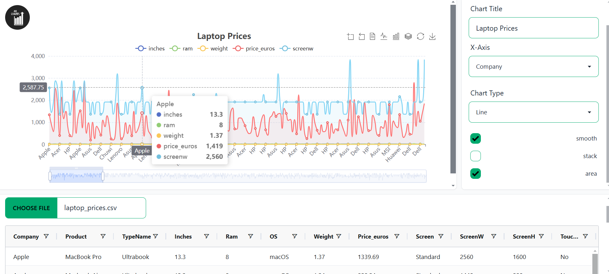

# AB Charts

### An Open-Source Tool for Visualizing CSV Data with Interactive Charts

---

## Overview

AB Charts is a user-friendly, open-source solution that helps you visualize your CSV data in various chart formats. Simply upload any CSV file, and AB Charts will let you select the most suitable chart type to represent your data effectively.

---

## Features

- **Flexible CSV Upload**: Easily upload any CSV file containing your data.
- **Multiple Chart Options**: Choose from various chart types to best display your data.
- **Intuitive Interface**: Simple and clean design for a seamless user experience.
- **Open Source**: Free to use and contribute to, with a community-driven approach.

## How It Works

1. **Upload a CSV File**: Load your data by uploading a CSV file directly.
2. **Select a Chart Type**: Choose from options like bar, line, pie, and more.
3. **Customize and View**: Customize chart settings to best fit your data needs.

### Note

I am a solo developer working on this so bug fixes, new charts options and other different features will
be rolling slowly but surely.
